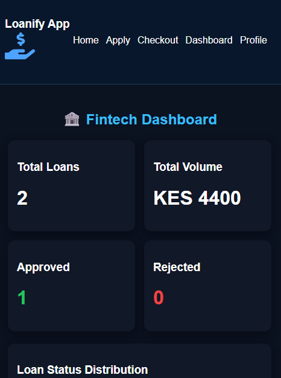
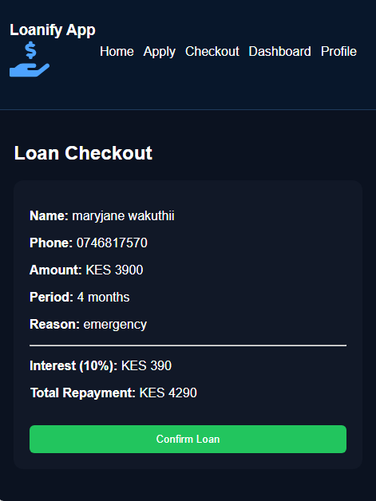
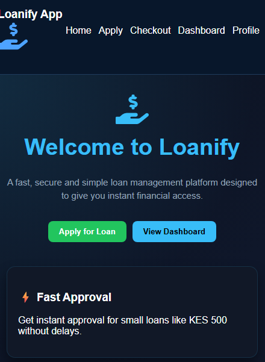
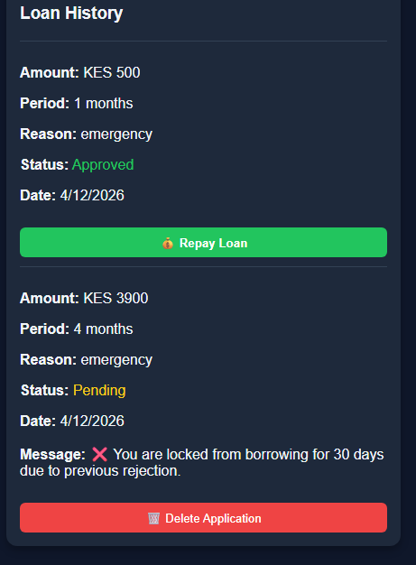

# 💰 Loan Application System

## 📌 Overview
The Loan Application System is a modern web application built with React that allows users to apply for loans, review repayment details, and manage their loan history.

The system automatically calculates interest and provides a clear, transparent checkout process before submission.

---

## 🚀 Features

- 📝 Loan application form  
- 📊 Automatic interest calculation (10%)  
- 💳 Loan checkout summary  
- 📱 User profile management  
- 🔐 Protected routes for secure access  
- 💾 LocalStorage data persistence  
- 📂 Dashboard to view loan history  

---

## 🎯 Problem It Solves

Many users face challenges when applying for loans, such as:
- Hidden charges  
- Complicated bank processes  
- Lack of repayment clarity  

### ✅ Solution
This app provides:
- Transparent loan breakdown  
- Clear total repayment calculation  
- Simple and user-friendly interface  

---

## 👥 Target Users

- Students  
- Small business owners  
- Individuals needing quick loans  

---

## 🖥️ Tech Stack

- React.js  
- React Router  
- JavaScript  
- LocalStorage  
- CSS  

---

## ⚙️ How It Works

1. User fills out the loan application form  
2. Data is temporarily stored  
3. System calculates 10% interest  
4. Checkout page displays total repayment  
5. User confirms and loan is saved to dashboard  

---

## 📸 Screenshots

_:_
_:_
_!:_
_!:_


- Home Page  
- Loan Application Page  
- Checkout Page  
- Dashboard  

---

## 🛠️ Installation

```bash
git clone https://github.com/your-username/loan-app.git
cd loan-app
npm install
npm run dev